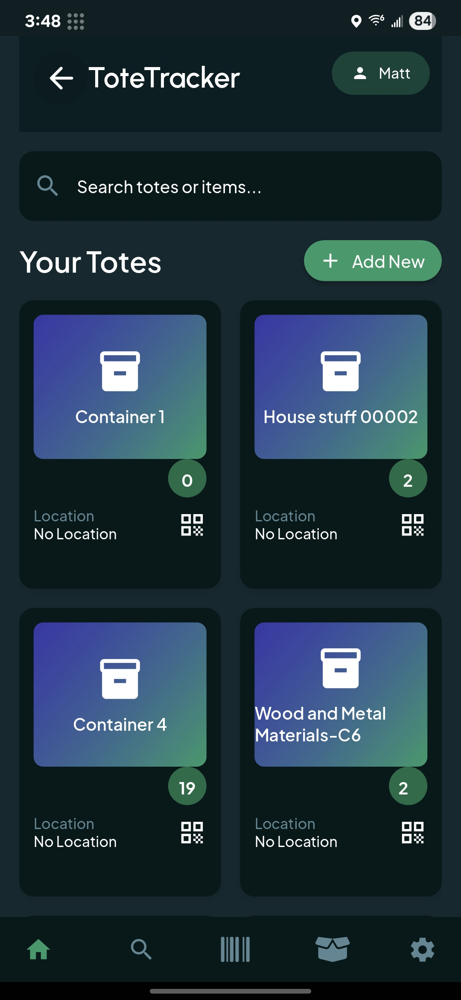
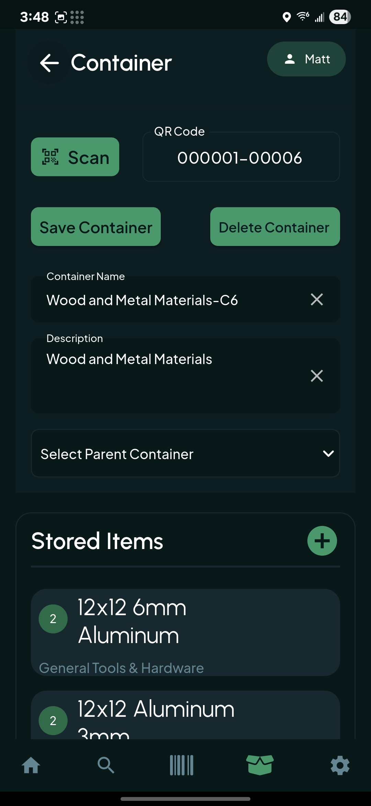
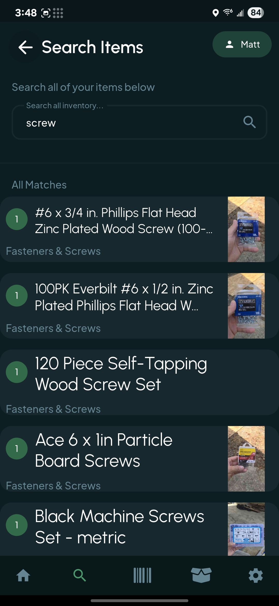
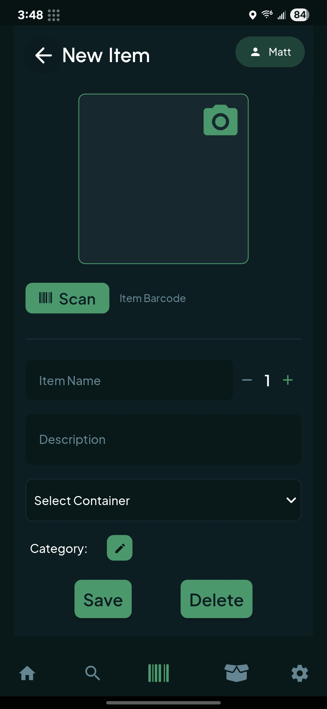
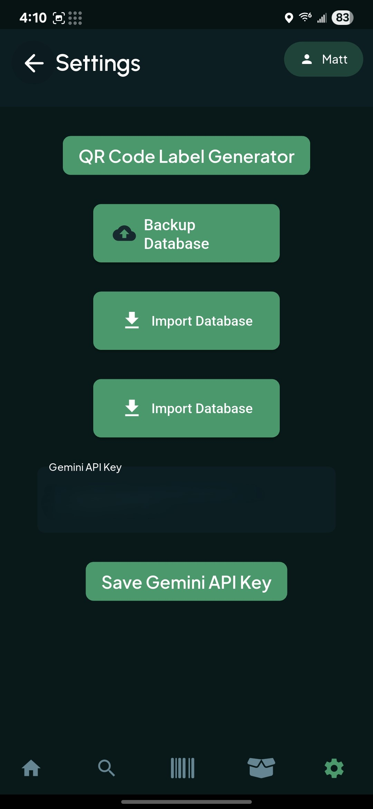

# ToteTracker

This is a storage tracking Android application. It stores a local SQLite DB on the device containing a list of all storage containers and their contents, for easy tracking.

Built with FlutterFlow

## Getting Started

Functionality includes:

* Allows uploading the Database to default device 'share' options for backup and retrieval
* AI image analysis to automatically name & classify objects being stored
  * A Gemini API key must be provided in the settings in order for this to function properly
* AI Alternative: Uses API to get item details from scanned barcodes
* Item images stored as base64-encoded strings, directly in the database

<table>
  <tr>
    <td></td>
    <td></td>
    <td></td>
    <td></td>
  </tr>
 <tr>
  <td></td>
 </tr>
</table>
